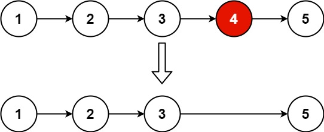

# 19. Remove Nth Node From End of List

 🟠 Medium

 Given the head of a linked list, remove the nth node from the end of the list and return its head.

Example 1:


```
Input: head = [1,2,3,4,5], n = 2
Output: [1,2,3,5]
```

Example 2:
```
Input: head = [1], n = 1
Output: []
```

Example 3:
```
Input: head = [1,2], n = 1
Output: [1]
```

Constraints:
- The number of nodes in the list is sz.
- 1 <= sz <= 30
- 0 <= Node.val <= 100
- 1 <= n <= sz

## Approach
### 
- **Parsing**: 
題目要求，將linkedList中的倒數第n個節點刪除。
可以的話，只用O(n)的時間複雜度演算法來完成。
假如暴力法的話，可以先走完整個linkedlist，知道總共有幾個節點，然後再去刪除要求的位置節點就好了。
這裡嘗試只用一次流程就完成整個計算。
首先，建立要操作的指標，先建立一個假頭，放在head前面，
另外這裡可以使用快慢針的概念，讓快針先走N個步數，接著再讓快慢針一起前進，就可以確認要刪除哪個節點。
```
ListNode* dummyHead = new ListNode(0, head);
ListNode* fast;
ListNode* slow;
```
先讓慢針指向假頭，快針指向head，
```
slow = dummyHead;
fast = dummyHead->next;
```
根據n的大小，將快針向前移動幾步。
```
while(n--) {
    fast = fast->next;
}
```
接著一起移動快慢針，當快針移動到空位址就代表已經到底了，這時候脫離while。
```
while(fast) {
    fast = fast->next;
    slow = slow->next;
}
```
這時候慢針所在的位置，的後一個節點，就是要刪除的節點，只要將其刪除就可以了。
```
ListNode* tmp = slow->next;
slow->next = slow->next->next;
head = dummyHead->next;
delete(dummyHead);
delete(tmp);

return head;
```

以下是模擬流程。
   slow         fast    
dummyHead       Head
     0            1         2       3       4       5       NULL

因為n=2，fast向後移動兩格。
   slow                           fast    
dummyHead       Head
     0            1         2       3       4       5       NULL

接著快慢針一起向後移動
                slow                       fast    
dummyHead       Head
     0            1         2       3       4       5       NULL

                          slow                    fast    
dummyHead       Head
     0            1         2       3       4       5       NULL

快針移動到空節點，慢針在3的位置，而4就是要刪除的節點。
                                  slow                      fast    
dummyHead       Head
     0            1         2       3       4       5       NULL


- **空間複雜度**: O(1)
- **時間複雜度**: O(N)