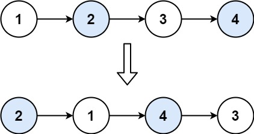

# 24. Swap Nodes in Pairs

🟠 Medium

Given a linked list, swap every two adjacent nodes and return its head. You must solve the problem without modifying the values in the list's nodes (i.e., only nodes themselves may be changed.)

Example 1:
```
Input: head = [1,2,3,4]

Output: [2,1,4,3]

Explanation:
```


Example 2:
```
Input: head = []

Output: []
```

Example 3:
```
Input: head = [1]

Output: [1]
```

Example 4:
```
Input: head = [1,2,3]

Output: [2,1,3]
```

Constraints:
- The number of nodes in the list is in the range [0, 100].
- 0 <= Node.val <= 100

## Approach
### 
- **Parsing**: 
    題目要求，將linklist的內容兩兩交換，假如湊不足兩個節點，就不交換。
    首先，建立假頭，放在head前面，然後建立current指標，來操作移動。
    ```
    ListNode* dummyHead = new ListNode(0, head);
    ListNode* current;
    ```
    建立另外兩個指標，用來記錄後面要轉向的節點。
    ```
    ListNode* tmp1;
    ListNode* tmp2;
    ```
    將current指向dummyHead，然後通過while來向後移動操作，因為要操作的是節點的兩兩交換，所以只要後面沒有兩個節點，那就跳出操作。
    ```
    current = dummyHead;
    while(current->next!=nullptr && current->next->next!=nullptr) {
    ```
    將節點記錄起來，tmp1指向當前的後一個節點，也就是要操作交換的兩個節點的前項，tmp2指向當前的下下下個節點，也就是要交換的節點之後的下一個節點。
    ```
    tmp1 = current->next;
    tmp2 = current->next->next->next;
    ```
    以下用來模擬開頭的狀況，一開始current會指向dummyHead，tmp1指向1的位置，tmp2指向3的位置。
    current        tmp1                   tmp2
    0               1           2           3
    我們的目標就像下方，要讓current指向2，然後2指向1，之後1指向3，
                    |----------------------|
                    |                      V 
    current        tmp1                   tmp2
    0               1 <-------- 2           3
    |                           ^
    |---------------------------|
    這個流程其實就像是下方的code的行為，通過改變current的next，next->next還有next->next->next，光是這樣就可以達到上面的模擬效果，
    ```
    current->next = current->next->next;
    current->next->next = tmp1;
    current->next->next->next = tmp2;
    ```
    最後要將current指向下一段要改變的兩個節點的前一項，也就是current->next->next，這樣下一輪就可以繼續同樣的操作。
    ```
    current = current->next->next;
    ```
    最後將head指向dummyHead的下一個節點，然後回傳head就好。
    ```
    head = dummyHead->next;
    delete(dummyHead);
    return head;
    ```
- **空間複雜度**: O(1)
- **時間複雜度**: O(N)