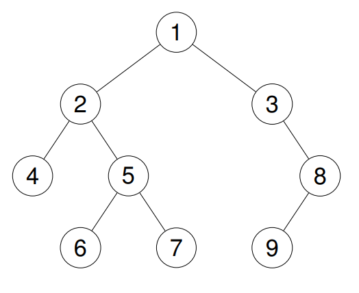

# 94. Binary Tree Inorder Traversal

🟢 Easy

Given the root of a binary tree, return the inorder traversal of its nodes' values.

Example 1:
```
Input: root = [1,null,2,3]

Output: [1,3,2]
```


Example 2:
```
Input: root = [1,2,3,4,5,null,8,null,null,6,7,9]

Output: [4,2,6,5,7,1,3,9,8]
```


Example 3:
```
Input: root = []

Output: []
```

Example 4:
```
Input: root = [1]

Output: [1]
```

Constraints:
- The number of nodes in the tree is in the range [0, 100].
- -100 <= Node.val <= 100

## Approach
### Binary tree
- **Parsing**: 
    二元樹，中序遍歷，左中右，三字口訣記住，有兩種做法，一種是迭代，第二種是遞迴，通常解法都會用遞迴，遞迴更直觀，但是在高層數的時候有機會爆掉，因為每次遞迴都會將當前的資料押入stack，
    層數過高，有可能會造成資料過多而爆炸，但是迭代不同，迭代只會在當前function執行，但是邏輯會需要再思考，不像遞迴直覺。

    迭代的作法在三種遍歷法都不同，這裡講解中序遍歷的迭代法，
    
    首先需要指針，指向當前的樹的內容，第二個是stack，要能儲存treeNode指標的結構，第三個是回傳的vector。
    ```
    std::vector<int> ret;
    TreeNode* curr = root;
    std::stack<TreeNode*> st;
    ```

    接著需要通過while迴圈不斷的嘗試遍歷整個樹，while的條件設定為，curr的指針不能為空，或者是stack不能為空，在嘗試遍歷的時候，有可能curr會指向最底層的node的在下一層，但是這時候stack中
    是還有東西的，代表樹還沒有巡完，只有當兩個條件都符合了，才代表樹已經都走完了。
    ```
    while(curr != NULL || !st.empty()) {
    ```

    接著要通過第二個while嘗試一路走到樹的最左邊的底部，因為是中序，左中右，所以先向最左邊走，但是走的過程中，要將路上經過的節點都填入stack，
    這是個重點，為什麼是填入stack，因為stack的特性是先進後出，假設樹長成下方樣子，填入stack後就會是，[1, 2, 3]，當要取值的時候，就會先把3取出來，
    那是否就是拿到了最左下方的節點內容，接著依序取出，就會像是二元樹遍歷的方式，先取葉，再取根，
    ```
         1
        /
       2
      /
     3
    ```

    所以這裡要通過while迴圈，只要curr不為空，就一路向左到底，中間經過的節點通通塞入stack中，
    ```
    while(curr != NULL) {
        st.push(curr);
        curr = curr->left;
    }
    ```

    接著進入下一層邏輯，當已經到達最左邊的底部，沒有下一個節點了，這時候stack中長成，[1, 2, 3]，這時候要將stack最上方的內容取出，也就是3，
    取出來後就可以填入ret中，這時候stack中長這樣，[1, 2]，再來，嘗試進入3的右邊，因為這是中序，左中右，左邊走完，取中間，3現在是中間，要再嘗試取右邊，這時候右邊沒有東西，
    所以我們可以再將stack中的下一個值取出來，2，將2填入ret中，注意，這時候的stack，[1]只剩下1，接著嘗試進去2的右邊，有值，是4，這時候要回到上一步的邏輯，curr不為空，將4
    填入stack中，所以是，[1, 4]，然後循環，所以可以想像再來依序從stack取出來的值再填回去ret就會是，[3, 2, 4, 1]，這就是中序遍歷。
    ```
         1
        /
       2
      / \
     3   4
    ```

    將以上邏輯寫成程式碼就會如下，
    ```
    curr = st.top();
    st.pop();
    ret.push_back(curr->val);
    curr = curr->right;
    ```

- **空間複雜度**: O(N)
- **時間複雜度**: O(N)