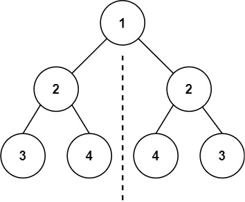
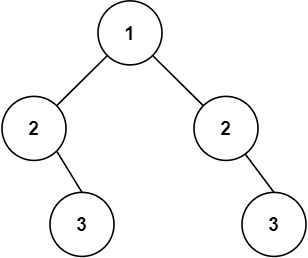

# 101. Symmetric Tree

🟢 Easy

Given the root of a binary tree, check whether it is a mirror of itself (i.e., symmetric around its center).

Example 1:

```
Input: root = [1,2,2,3,4,4,3]
Output: true
```

Example 2:

```
Input: root = [1,2,2,null,3,null,3]
Output: false
```

Constraints:
- The number of nodes in the tree is in the range [1, 1000].
- -100 <= Node.val <= 100

## Approach
### BFS
- **Parsing**: 
    題目給出一個樹，要求確認這個樹是否左右對稱。

    題目看似簡單，其實有點小難，要稍微轉換一下思路。

    這題還是可以通過queue實現的BFS來完成，只是以往都是一次填入一個節點，開頭的時候要改成一次填入左跟右，這樣才可以左右比對。
    ```
    queue<TreeNode*> q;

    q.push(root->left);
    q.push(root->right);
    ```

    接著依樣是判斷queue是否為空來決定要不要繼續，
    ```
    while(!q.empty()) {
    ```

    還需要左跟右兩個TreeNode pointer來同時取出節點，這樣才可以比對，
    ```
    TreeNode* l;
    TreeNode* r;

    l=q.front();
    q.pop();
    r=q.front();
    q.pop();
    ```

    接著是重點，假設兩個節點都為nullptr，那就代表兩個內容相同，所以跳過後續的動作，進行下一次。
    假如今天進來的root只有一個節點，在這裡就會進入if，直接跳過，接著就會因為queue已經空了，所以直接回傳true，
    ```
    if(l==nullptr && r==nullptr) {
        continue;
    }
    ```

    接著判斷左右是否為nullptr，因為前面已經判斷過兩個節點都為nullptr的狀態了，這次還有nullptr的話，代表的是只有其中之一是nullptr，那就一定不會是鏡像，所以回false，
    這裡要記的，if判斷式是從左到右，順序很重要，先判斷是否為nullptr，接著再判斷兩個節點的內容是否相同，不同的話也要回false。
    ```
    if(l==nullptr || r==nullptr || (l->val != r->val)) {
        return false;
    }
    ```

    前面都完成之後，因為每次取值都會是一次取兩個，並且為了判斷鏡像，所以這裡要左右交替的將子節點放到queue之中，
    ```
    q.push(l->left);
    q.push(r->right);
    q.push(l->right);
    q.push(r->left);
    ```
- **空間複雜度**: O(N)
- **時間複雜度**: O(N)