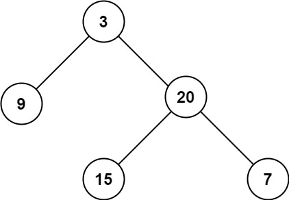

# 104. Maximum Depth of Binary Tree

🟢 Easy

Given the root of a binary tree, return its maximum depth.

A binary tree's maximum depth is the number of nodes along the longest path from the root node down to the farthest leaf node.

Example 1:

```
Input: root = [3,9,20,null,null,15,7]
Output: 3
```

Example 2:
```
Input: root = [1,null,2]
Output: 2
```

Constraints:
- The number of nodes in the tree is in the range [0, 104].
- -100 <= Node.val <= 100

## Approach
### BFS
- **Parsing**: 
    題目給出一個tree，要求回傳這個樹的最大深度為多少。

    這題可以通過queue來達成BFS的標準做法完成，

    首先root為空的時候，直接回傳0，代表沒有結點可以訪問。
    ```
    if(root==nullptr) {
        return 0;
    }
    ```

    開始先建立用來輔助完成BFS的queue，並且建立要計算階層的ret變數，要記的初始化，接著將root推入到queue中即可。
    ```
    queue<TreeNode*> q;
    int ret=0;

    q.push(root);
    ``` 

    然後就是通過queue訪問節點的標準做法，只是要記的，每次訪問queue中的節點前，將ret+1，因為每次執行for迴圈前，就代表這是新的一個階層，只要在這個時候累加，最後完成時即可知道最大深度為多少。
    ```
    while(!q.empty()) {
        int size = q.size();
        TreeNode* curr;

        ret++;

        for(int i=0;i<size;i++) {
            curr = q.front();
            q.pop();

            if(curr->left)
                q.push(curr->left);
            if(curr->right)
                q.push(curr->right);
        }
    }
    ```
- **空間複雜度**: O(N)
- **時間複雜度**: O(N)