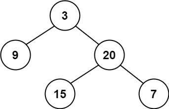
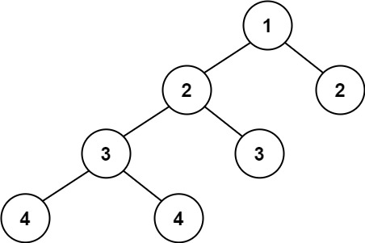

# 110. Balanced Binary Tree

🟢 Easy

Given a binary tree, determine if it is height-balanced.

height-balanced: A height-balanced binary tree is a binary tree in which the depth of the two subtrees of every node never differs by more than one.

Example 1:

```
Input: root = [3,9,20,null,null,15,7]
Output: true
```

Example 2:

```
Input: root = [1,2,2,3,3,null,null,4,4]
Output: false
```

Example 3:
```
Input: root = []
Output: true
```

Constraints:
- The number of nodes in the tree is in the range [0, 5000].
- -104 <= Node.val <= 104

## Approach
### Recursive
- **Parsing**: 
    題目給出一個二元樹，要求判斷這個樹是否為高平衡，高平衡定義是每個樹中的任意一個節點，他的左右子樹，高度落差不能超過一。

    這題要想清楚，因為要判斷的是每個節點的左右子樹高度，所以不能使用queue的BFS來完成。

    所以要反向思考，要如何讓節點知道左右樹有多高，那可以從下往上增加，每多一層就加一，到節點的時候只要左右比較就可以知道結果，只要其中一個點左右樹高度超過一那就要回傳false，

    從此可以總結三點，
    1. 從下往上遞增。
    2. 左右樹的高度落差不能超過1。
    3. 左右樹的高度落差超過1的時候要回傳false。

    根據這三點，可以使用遞迴，先建立一個遞迴的function，因為要回傳樹的高度，所以回傳值用int，輸入函數要輸入樹的point，
    ```
    int help(TreeNode* root) {
    ``` 

    遞迴函式必須考慮停止的時候，那訪問樹的時候要怎麼停止，當節點為空的時候就可以停止了，這時候回傳0即可。
    ```
    if(root == nullptr) {
        return 0;
    }
    ```

    再來要計算取得左右樹的高度，先取左樹的高度，這個函式的設計回傳值就是高度，所以建立一個變數l來接左樹的高度，
    當左樹的高度取得為-1，-1結果代表左樹裡面有個節點的左右高度差距大於1，這時候就不用管當前一層的結果了，
    直接將-1回傳即可，因為已經確認這不是高度平衡樹了。
    ```
    int l = help(root->left);
    if(l == -1)
        return -1;
    ```

    右樹是一樣的邏輯，只是換成判斷右邊。
    ```
    int r = help(root->right);
    if(r == -1)
        return -1;
    ```

    假設收到的結果都不為-1，那就比較左右高度的差值，只要大於1，那就回傳-1。
    ```
    if(abs(l-r)>1) {
        return -1;
    }
    ```

    最終，通過以上判斷後，當前節點還是高平衡樹，所以取左右高度較高的一個，將其加一，也就是當前一層也加上去，回傳到上一層。
    ```
    return max(l, r)+1;
    ```

    而在最開始呼叫的function中，只要判斷收到的結果是不是-1就好。
    ```
    return help(root)==-1? false:true;
    ```
- **空間複雜度**: O(N)
- **時間複雜度**: O(N)