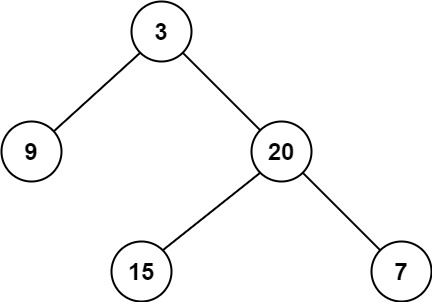

# 111. Minimum Depth of Binary Tree

🟢 Easy

Given a binary tree, find its minimum depth.

The minimum depth is the number of nodes along the shortest path from the root node down to the nearest leaf node.

Note: A leaf is a node with no children.

Example 1:

```
Input: root = [3,9,20,null,null,15,7]
Output: 2
```

Example 2:
```
Input: root = [2,null,3,null,4,null,5,null,6]
Output: 5
```

Constraints:
- The number of nodes in the tree is in the range [0, 105].
- -1000 <= Node.val <= 1000

## Approach
### BFS
- **Parsing**: 
    題目給出一個樹，要求找出這個樹從root到葉的最短距離，葉子的定義必須要沒有chilren。

    這題還是可以使用經典的queue來完成BFS，只是需要注意，葉子的定義，最開始有可能誤會只要有第一個節點就可以回傳了，
    但是題目有提醒，是到葉子的最短距離，所以必須判斷是否沒有chilren，

    首先判斷root是否為null，只要為null那就可以直接回傳0，因為根本沒有樹。
    ```
    if(root==nullptr) {
        return 0;
    }
    ```

    接著建立BFS必須要的queue，並把root推入queue中，然後還有用來計算最短路徑長的min。
    ```
    queue<TreeNode*> q;
    int min = 0;

    q.push(root);
    ```

    queue來實現BFS的做法都是，只要queue不為空，那就持續探詢，
    建立一個變數size，用來表示當前樹這一層有幾個節點，
    curr是用來指向當前樹這一層的節點，
    因為每下一層，就需要紀錄到達那一層，所以min要累加一，
    然後通過for迴圈，就可以輪巡queue當前儲存的節點，並且不會超出當前層的範圍，
    ```
    while(!q.empty()) {
        int size = q.size();
        TreeNode* curr;
        
        min++;

        for(int i=0;i<size;i++) {
    ```

    接著用curr來指向queue中儲存的節點，
    取出後就拋棄。
    ```
    curr = q.front();
    q.pop()
    ```

    只要找到不存在左跟右的節點，直接回傳結果。
    ```
    if(curr->left==nullptr && curr->right==nullptr) {
        return min;
    }
    ```

    假如一直到最後一層，那也就是回傳min即可。
    ```
                if(curr->left)
                    q.push(curr->left);
                if(curr->right)
                    q.push(curr->right);
            }
        }

        return min;
    ```
- **空間複雜度**: O(N)
- **時間複雜度**: O(N)