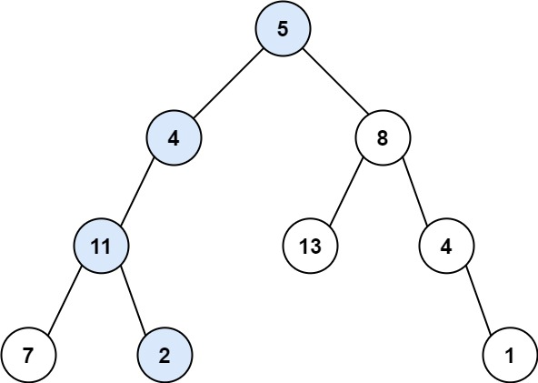
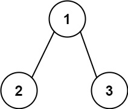

# 112. Path Sum

🟢 Easy

Given the root of a binary tree and an integer targetSum, return true if the tree has a root-to-leaf path such that adding up all the values along the path equals targetSum.

A leaf is a node with no children.

Example 1:

```
Input: root = [5,4,8,11,null,13,4,7,2,null,null,null,1], targetSum = 22
Output: true
Explanation: The root-to-leaf path with the target sum is shown.
```

Example 2:

```
Input: root = [1,2,3], targetSum = 5
Output: false
Explanation: There are two root-to-leaf paths in the tree:
(1 --> 2): The sum is 3.
(1 --> 3): The sum is 4.
There is no root-to-leaf path with sum = 5.
```

Example 3:
```
Input: root = [], targetSum = 0
Output: false
Explanation: Since the tree is empty, there are no root-to-leaf paths.
```

Constraints:
- The number of nodes in the tree is in the range [0, 5000].
- -1000 <= Node.val <= 1000
- -1000 <= targetSum <= 1000

## Approach
### DFS
- **Parsing**: 
    題目給出一個樹，還有一個數字，要求找出這個樹是否從根到葉，有一條路徑上的數值加起來會等於數字。

    這題我採用遞迴解決，只要透過遞迴，每往下一層，就將target數值減去當前節點的數值，
    我採用的方式是inorder，中序歷遍
    只要檢查到當前節點是葉子，只要這時候的target減去當前節點數值等於0，那就代表找到該條路徑，那就回傳答案即可。

    而中序在檢查完當前節點後，假如有左右子樹，那就繼續向下，將回傳的左右結果用OR處理，只要有其中一個是TRUE，那就可以接其結果回傳。
- **空間複雜度**: O(N)
- **時間複雜度**: O(N)