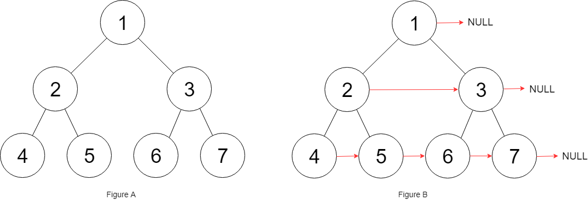

# 116. Populating Next Right Pointers in Each Node

🟠 Medium

You are given a perfect binary tree where all leaves are on the same level, and every parent has two children. The binary tree has the following definition:

struct Node {
  int val;
  Node *left;
  Node *right;
  Node *next;
}
Populate each next pointer to point to its next right node. If there is no next right node, the next pointer should be set to NULL.

Initially, all next pointers are set to NULL.

Example 1:

```
Input: root = [1,2,3,4,5,6,7]
Output: [1,#,2,3,#,4,5,6,7,#]
Explanation: Given the above perfect binary tree (Figure A), your function should populate each next pointer to point to its next right node, just like in Figure B. The serialized output is in level order as connected by the next pointers, with '#' signifying the end of each level.
```

Example 2:
```
Input: root = []
Output: []
```

Constraints:
- The number of nodes in the tree is in the range [0, 212 - 1].
- -1000 <= Node.val <= 1000

## Approach
### BFS
- **Parsing**: 
    題目給出一個樹，但是結構略有不同，除了左跟右，還有加上next這個節點，要將這棵樹的每個節點的右邊節點的pointer，給予next，假如已經是最右邊，那就給nullptr。

    這題可以通過BFS來完成，透過queue來執行BFS，先將root押進queue，
    ```
    queue<Node*> q;
    q.push(root);
    ```

    只要queue不為空，就代表樹還沒有走完，要繼續搜尋，
    ```
    while(!q.empty()) {
    ```

    跟一般BFS的流程差不多，建立curr，但是要多建立一個next，
    ```
    Node* curr;
    Node* next;
    int size = q.size();
    ```

    接著是熟悉的取出curr然後操作，這裡要做的是，因為一開始的size是當前queue中所存的Node的數量，代表的就是這一層樹的總結點數，只要i還沒有數到size-1，那就還沒有到最右邊的節點，
    所以在那之前，只要把queue中的下一個內容，賦予當前curr的next就好，
    而當走到最後一個了，讓next給值null就好。
    ```
    if(i!=(size-1)) {
        next = q.front();
        curr->next = next;
    }
    else {
        curr->next = nullptr;
    }
    ```
- **空間複雜度**: O(N)
- **時間複雜度**: O(N)