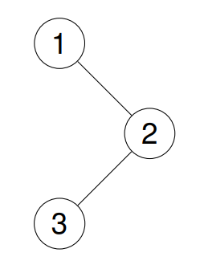

# 144. Binary Tree Preorder Traversal

🟢 Easy

Given the root of a binary tree, return the preorder traversal of its nodes' values.

Example 1:
```
Input: root = [1,null,2,3]

Output: [1,2,3]

Explanation:
```


Example 2:
```
Input: root = [1,2,3,4,5,null,8,null,null,6,7,9]

Output: [1,2,4,5,6,7,3,8,9]

Explanation:
```


Example 3:
```
Input: root = []

Output: []
```

Example 4:
```
Input: root = [1]

Output: [1]
```

Constraints:
- The number of nodes in the tree is in the range [0, 100].
- -100 <= Node.val <= 100

## Approach
### Binary tree
- **Parsing**: 
    這題給出一個二元樹，要求按造前序遍歷的順序將其中的內容填入vector中返回。

    這裡要記住的是前序的順序，口訣是中左右，記憶方式是前代表中是第一個，所以先看中，接著左右一定是先左再右，完整就是左中右，以這個口訣記憶就不會出錯。

    因為要遍歷整個tree，所以要有辦法檢查tree，所以這裡創造個新function，輸入參數第一個是TreeNode的指針，第二個參數是要儲存的buffer。
    ```
    void preorder(TreeNode *root, std::vector<int> &buf) 
    ```

    進入function後的第一件事就是檢查指針是否為空，假如為空那就直接返回。
    ```
    if(root == NULL) {
        return;
    }
    ```

    接著前面的口訣，中左右，這時候就先將當前的指針的內容填入buffer中，代表先讀取中間節點的內容。
    ```
    buf.push_back(root->val);
    ```

    接著通過遞迴，也就是呼叫自身的function，訪問當前節點的左邊，接著再訪問當前節點的右邊，通過這種方式，就可以達到中左右的遍歷。
    ```
    preorder(root->left, buf);
    preorder(root->right, buf);
    ```

    這裡講解前序遍歷迭代法，
    前序的順序是，中左右，根據這個順序，假如要通過迭代法，可以使用stack來實現，
    以下面這個tree為例，假如是前序遍歷，順序應該是[1, 2, 4, 5, 3]，
    ```
         1
        / \
       2   3
      / \
     4   5
    ```

    假如使用stack儲存，先將root存入所以stack中會是[1]，接著先將1取出後填入回傳的vector中，所以會
    ```
    stack[]
    ret[1]
    ```
    再接著將1的右邊先填入stack中，接著再填入左邊，為什麼? 前序的順序不是中左右嗎?  因為stack是先進後出，先放右邊再放左邊，才可以把左邊先取出
    ```
    stack[3, 2]
    ret[1]
    ```

    接著再取出stack的top，也就是2，將他填入ret中，然後再將2的右邊跟左邊填入stack中，
    ```
    stack[3, 5, 4]
    ret[1, 2]
    ```

    所以上面可以看到，雛形出現了，按造上方的步驟，每次取出stack的top後，將其填入ret中，然後再將這個節點的右左節點填入stack，假如沒有呢?  那就不用繼續了，直接取出下一個值。
    ```
    stack[3, 5]
    ret[1, 2, 4]
    ```

    ```
    stack[3]
    ret[1, 2, 4, 5]
    ```

    經過連續兩次的動作，就可以看到左邊的節點都已經走完了，也填入到ret中了，那剩下的最後一個數值就會是3，也就是root的右邊，將其填回去ret中即可。
- **空間複雜度**: O(N)
- **時間複雜度**: O(N)