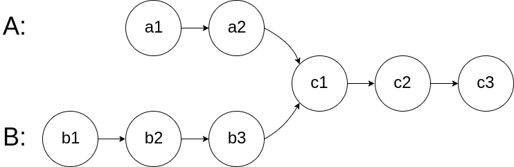
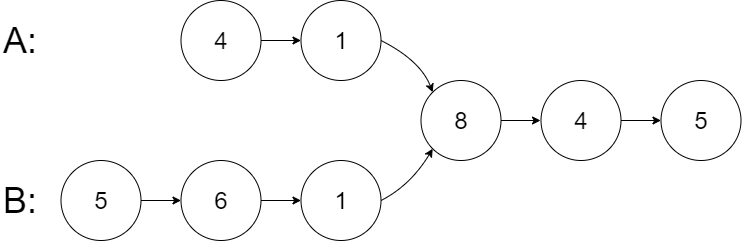

# 160. Intersection of Two Linked Lists

🟢 Easy

Given the heads of two singly linked-lists headA and headB, return the node at which the two lists intersect. If the two linked lists have no intersection at all, return null.

For example, the following two linked lists begin to intersect at node c1:



The test cases are generated such that there are no cycles anywhere in the entire linked structure.

Note that the linked lists must retain their original structure after the function returns.

Custom Judge:

The inputs to the judge are given as follows (your program is not given these inputs):
- intersectVal - The value of the node where the intersection occurs. This is 0 if there is no intersected node.
- listA - The first linked list.
- listB - The second linked list.
- skipA - The number of nodes to skip ahead in listA (starting from the head) to get to the intersected node.
- skipB - The number of nodes to skip ahead in listB (starting from the head) to get to the intersected node.
The judge will then create the linked structure based on these inputs and pass the two heads, headA and headB to your program. If you correctly return the intersected node, then your solution will be accepted.


Example 1:


```
Input: intersectVal = 8, listA = [4,1,8,4,5], listB = [5,6,1,8,4,5], skipA = 2, skipB = 3
Output: Intersected at '8'
Explanation: The intersected node's value is 8 (note that this must not be 0 if the two lists intersect).
From the head of A, it reads as [4,1,8,4,5]. From the head of B, it reads as [5,6,1,8,4,5]. There are 2 nodes before the intersected node in A; There are 3 nodes before the intersected node in B.
- Note that the intersected node's value is not 1 because the nodes with value 1 in A and B (2nd node in A and 3rd node in B) are different node references. In other words, they point to two different locations in memory, while the nodes with value 8 in A and B (3rd node in A and 4th node in B) point to the same location in memory.
```

Example 2:


```
Input: intersectVal = 2, listA = [1,9,1,2,4], listB = [3,2,4], skipA = 3, skipB = 1
Output: Intersected at '2'
Explanation: The intersected node's value is 2 (note that this must not be 0 if the two lists intersect).
From the head of A, it reads as [1,9,1,2,4]. From the head of B, it reads as [3,2,4]. There are 3 nodes before the intersected node in A; There are 1 node before the intersected node in B.
```

Example 3:


```
Input: intersectVal = 0, listA = [2,6,4], listB = [1,5], skipA = 3, skipB = 2
Output: No intersection
Explanation: From the head of A, it reads as [2,6,4]. From the head of B, it reads as [1,5]. Since the two lists do not intersect, intersectVal must be 0, while skipA and skipB can be arbitrary values.
Explanation: The two lists do not intersect, so return null.
```

Constraints:
- The number of nodes of listA is in the m.
- The number of nodes of listB is in the n.
- 1 <= m, n <= 3 * 104
- 1 <= Node.val <= 105
- 0 <= skipA <= m
- 0 <= skipB <= n
- intersectVal is 0 if listA and listB do not intersect.
- intersectVal == listA[skipA] == listB[skipB] if listA and listB intersect.

## Approach
### 
- **Parsing**: 
題目給出兩個linked list，兩個list有機會從某個節點開始會重合，題目要求找出該節點並回傳，假如沒有重合那就回傳NULL。
這題可以用一個比較特殊的思考模式，以下是兩個linked list，B較A長一點，可以看出，從8開始兩個節點就是相同的，但是因為長度不同，所以要通過演算法去判斷，
A: 4 1 8 4 5
B: 5 6 1 8 4 5
換個角度思考，假如我們走完A之後，然後把B接在A之後呢?  B也是同樣的作法，走完B之後，將A接在B後面，那就會呈現下面這樣，
A: 4 1 8 4 5 5 6 1 8 4 5
B: 5 6 1 8 4 5 4 1 8 4 5
我們可以看到不同的長度的兩個list，當互相接在一起後，長度會相等了，並且，重合的部分在最後面也會重合了，我們就可以通過這種方式來實驗我們的演算法。
首先，先宣告兩個pointer，用來從不同的list開始走，
```
ListNode* tmpA;
ListNode* tmpB;
```
當出現其中一個list為空的時候，直接回傳NULL。
```
if(headA==NULL || headB==NULL) {
    return NULL;
}
```
將兩個pointer分別指向不同的list，
```
tmpA = headA;
tmpB = headB;
```
我們通過while來讓pointer可以一直走下去，因為兩個list長度不同，所以一定會出現其中一個list先走完的現象，那這時候只要另一個list還沒走完，那就可以繼續搜尋下去。
```
while(tmpA || tmpB) {
```
首先判斷兩個節點是否相同，是的話直接回傳該節點
```
if(tmpA == tmpB) {
    return tmpA;
}
```
以listA為例，當已經走到listA的末端時，pointer已經指到NULL了，這時候要將這個pointer指向另一個節點，變相的做出將兩個list接續在一起的動作，
另一個pointer也是相同操作，這樣就可以達到我們演算法的目的，假如走到最後到底了，那兩個pointer都會為0，那就代表沒有相合的點，直接回傳NULL。
```
if(tmpA == NULL) {
    tmpA = headB;
}
else {
    tmpA = tmpA->next;
}
```
- **空間複雜度**: O(1)
- **時間複雜度**: O(N+M)