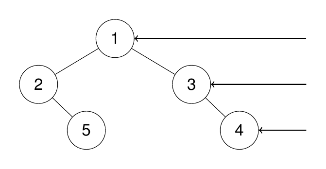
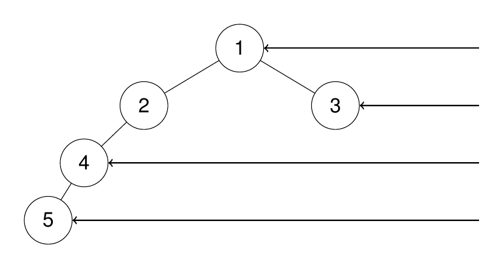

# 199. Binary Tree Right Side View

🟠 Medium

Given the root of a binary tree, imagine yourself standing on the right side of it, return the values of the nodes you can see ordered from top to bottom.

Example 1:
```
Input: root = [1,2,3,null,5,null,4]

Output: [1,3,4]

Explanation:
```


Example 2:
```
Input: root = [1,2,3,4,null,null,null,5]

Output: [1,3,4,5]

Explanation:
```


Example 3:
```
Input: root = [1,null,3]

Output: [1,3]
```

Example 4:
```
Input: root = []

Output: []
```

Constraints:
- The number of nodes in the tree is in the range [0, 100].
- -100 <= Node.val <= 100

## Approach
### queue
- **Parsing**: 
    這一題的題目要求是，給出一個二元樹，假設我們是站立在這棵樹的右方，從右側看來，每一層的最右方的數值，從上到下，將其填進vector中返回。
    題目要求很清楚，我們只要將樹的最右方的數值蒐集起來就好了，這裡可以使用的方法為，queue，通過queue，可以做到BST，廣度優先搜尋，
    通過每一層的搜尋，只要把每一層的最後一個數值蒐集起來即可。

    所以這裡可以先用queue來運作，先建立一個vector來回傳，只要進來的root為空，直接回傳ret即可。
    ```
    vector<int> ret;

    if(root==NULL) {
        return ret;
    }
    ```

    接著就可以使用經典的queue BST搜尋，先建立一個queue，將root填入後，只要queue不為空，就不出來這個while，將著只要根據當前queue中的指針數量去輪巡，這就是這個tree一層的節點數量，接著只要把每一層掃過，並處理即可。
    ```
    queue<TreeNode*> q;

    q.push(root);

    while(!q.empty()) {
        TreeNode* curr;
        int size = q.size();

        for(int i=0;i<size;i++) {
    ```

    這裡就是關鍵部位，只要走到i值等於這一層的數量，也就是這一層的最後一個數值，將其存起來即可。
    ```
    if(i==(size-1)) {
        ret.push_back(curr->val);
    }
    ```
- **空間複雜度**: O(N)
- **時間複雜度**: O(N)