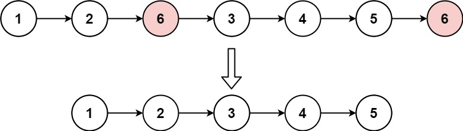

# 203. Remove Linked List Elements

 🟢 Easy

Given the head of a linked list and an integer val, remove all the nodes of the linked list that has Node.val == val, and return the new head.

Example 1:


```
Input: head = [1,2,6,3,4,5,6], val = 6
Output: [1,2,3,4,5]
```

Example 2:
```
Input: head = [], val = 1
Output: []
```

Example 3:
```
Input: head = [7,7,7,7], val = 7
Output: []
```

Constraints:
- The number of nodes in the list is in the range [0, 104].
- 1 <= Node.val <= 50
-  <= val <= 50

## Approach
### Linklist basic control
- **Parsing**: 
    題目給出一個linklist，要求將其中所有跟輸入val相同的節點刪除。
    按造最簡單的作法，只要另外建立一個pointer，輪巡整個list，符合內容的節點刪除就好，但是最簡單的做法有個特例，當符合條件的節點是在頭部時就需要為了頭部另外特別處理，
    所以這裡提供另一種解法，當開始的時候先建立一個假頭dummyHead，還有一個用來歷遍整個list的pointer。current，
    ```
    ListNode* dummyHead = new ListNode(0);
    ListNode* current;
    ```
    將dummyHead放到head前面，然後將current指向dummyHead，
    ```
    dummyHead->next = head;
    current = dummyHead;
    ```
    通過while來走過整個list，只要current的下一個不為空，就可以一直走下去，但是只要為空了，就代表到底了，可以脫離，
    ```
    while(current->next) {
    }
    ```
    在輪巡的時候，只要current的下一個數值等於val，就可以進行刪除，先建立一個暫時的pointer只項符合要求的節點，然後通過改動current的next指標，指向下下個，接著再刪除tmp指向的節點就可以了，
    ```
    if(current->next->val == val) {
        ListNode* tmp = current->next;
        current->next = current->next->next;
        delete(tmp);
        tmp = nullptr;
    }
    ```
    假如走到的位置沒有val相同的內容，那就繼續項下一個節點前進，
    ```
    else {
        current = current->next;
    }
    ```
    前面提到，因為在最前頭已經裝上一個假頭了，假如刪除過程將本來的頭刪除了，那也不用擔心，只要將head指向假頭的後面就可以了，那就會是整個list的新頭，之後只要將假頭刪除就可以回傳了。
    ```
    head = dummyHead->next;
    delete(dummyHead);
    dummyHead = nullptr;

    return head;
    ```

- **空間複雜度**: O(1)
- **時間複雜度**: O(N)