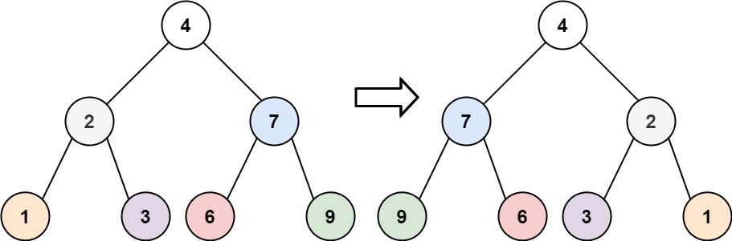
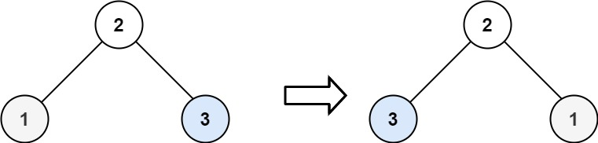

# 226. Invert Binary Tree

🟢 Easy

Given the root of a binary tree, invert the tree, and return its root.

Example 1:

```
Input: root = [4,2,7,1,3,6,9]
Output: [4,7,2,9,6,3,1]
```

Example 2:

```
Input: root = [2,1,3]
Output: [2,3,1]
```

Example 3:
```
Input: root = []
Output: []
```

Constraints:
- The number of nodes in the tree is in the range [0, 100].
- -100 <= Node.val <= 100

## Approach
### BFS
- **Parsing**: 
    題目給出一個樹，要求將其中的所有節點內容，翻轉過來，也就是左右顛倒。

    這題可以採用queue完成BFS，只要取到結點之後，
    ```
    curr = q.front();
    q.pop();
    ```

    將節點的左右孩子，交換即可。
    ```
    TreeNode* tmp;
    tmp = curr->left;
    curr->left = curr->right;
    curr->right = tmp;
    ```

    也可以採用swap。
    ```
    swap(curr->left, curr->right);
    ```
- **空間複雜度**: O(N)
- **時間複雜度**: O(N)