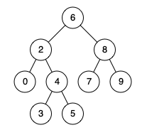

# 235. Lowest Common Ancestor of a Binary Search Tree

🟠 Medium

Given a binary search tree (BST), find the lowest common ancestor (LCA) node of two given nodes in the BST.

According to the definition of LCA on Wikipedia: “The lowest common ancestor is defined between two nodes p and q as the lowest node in T that has both p and q as descendants (where we allow a node to be a descendant of itself).”

Example 1:

```
Input: root = [6,2,8,0,4,7,9,null,null,3,5], p = 2, q = 8
Output: 6
Explanation: The LCA of nodes 2 and 8 is 6.
```

Example 2:

```
Input: root = [6,2,8,0,4,7,9,null,null,3,5], p = 2, q = 4
Output: 2
Explanation: The LCA of nodes 2 and 4 is 2, since a node can be a descendant of itself according to the LCA definition.
```

Example 3:
```
Input: root = [2,1], p = 2, q = 1
Output: 2
```

Constraints:
- The number of nodes in the tree is in the range [2, 105].
- -109 <= Node.val <= 109
- All Node.val are unique.
- p != q
- p and q will exist in the BST.

## Approach
### Recursive
- **Parsing**: 
    題目給出一個二元樹，樹是根據BST規則建立的，給出兩個節點，p跟q，要求找出這兩棵樹的共同祖先。

    這題其實跟236差不多，不過多了一個細節，樹的結構是BST，BST的每個節點都有規則，左子樹的內容一定小於根，右子樹的內容一定大於根，
    所以我們可以利用這個規則，只要找到一個節點，其數值處在p跟q之間，那就是祖先了。
    這裡可以使用兩種做法，第一種，遞迴，
    遞迴的重點是停止時機，當找到最底下，root等於null的時候，就回傳null，也就是當前的root。
    ```
    if(root==nullptr) {
        return root;
    }
    ```

    接著要確認要往哪個方向，因為是BST，所以看當前的root的值是否都大於pq的值，是的話，那pq就會在root的左邊，所以要遞迴往左邊走。
    ```
    if(root->val > p->val && root->val > q->val) {
        TreeNode* l = lowestCommonAncestor(root->left, p, q);
        if(l != nullptr) {
            return l;
        }
    }
    ```

    假如不是都大於pq，那就要確認是否root都小於pq，是的話那就要往右邊走。
    ```
    else if(root->val < p->val && root->val < q->val) {
        TreeNode* r = lowestCommonAncestor(root->right, p, q);
        if(r != nullptr) {
            return r;
        }
    }
    ```

    假如以上皆非，那就代表當前的節點就是祖先，直接回傳root即可。
    ```
    return root;
    ```

    這台還有一個更簡單的解法，直接針對方向往下找就好，因為已經確定是BST了，
    那只要透過比值就可以確定方向，那何不如直接一個while，讓point一路往下探尋呢?
    所以可以先Node來回傳結果。
    ```
    TreeNode* ret;
    ```

    建立while，沒找到祖先不出來。
    ```
    while(1) {
    ```

    接著沿用遞迴一模一樣的思路，比較root的數值，root大於pq那就代表要往左，所以直接改變root指針，往root的左邊過去。
    ```
    if(root->val > p->val && root->val > q->val) {
        root = root->left;
    }
    ```

    root小於pq，那就往右邊。
    ```
    else if(root->val < p->val && root->val < q->val) {
        root = root->right;
    }
    ```

    以上皆非，那就記錄下位置，脫離while，直接回傳即可。
    ```
    else {
        ret = root;
        break;
    }
    ```
- **空間複雜度**: O(H)
- **時間複雜度**: O(N)