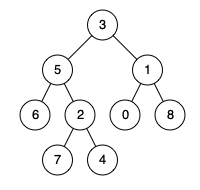

# 236. Lowest Common Ancestor of a Binary Tree

🟠 Medium

Given a binary tree, find the lowest common ancestor (LCA) of two given nodes in the tree.

According to the definition of LCA on Wikipedia: “The lowest common ancestor is defined between two nodes p and q as the lowest node in T that has both p and q as descendants (where we allow a node to be a descendant of itself).”

Example 1:

```
Input: root = [3,5,1,6,2,0,8,null,null,7,4], p = 5, q = 1
Output: 3
Explanation: The LCA of nodes 5 and 1 is 3.
```

Example 2:

```
Input: root = [3,5,1,6,2,0,8,null,null,7,4], p = 5, q = 4
Output: 5
Explanation: The LCA of nodes 5 and 4 is 5, since a node can be a descendant of itself according to the LCA definition.
```

Example 3:
```
Input: root = [1,2], p = 1, q = 2
Output: 1
```

Constraints:
- The number of nodes in the tree is in the range [2, 105].
- -109 <= Node.val <= 109
- All Node.val are unique.
- p != q
- p and q will exist in the tree.

## Approach
### Recursive
- **Parsing**: 
    題目給出一個樹，跟兩個樹枝中的節點，要求找出他們的共同祖先，假如節點之一是另一個節點的祖先，也直接回傳該節點。

    這題可以通過遞迴postorder來解決，題目已經設計回傳tree的pointer了，所以只要找到該節點，回傳，
    當在遞迴的過程，postorder會需要走左右中，只要其中一個節點左右都收到非nullptr的內容，就代表他是兩個節點的祖先。
    
    首先遞迴建立停止的判斷式，當碰到指定節點或是已經到底了，就返回該節點，到底就是nullptr，所以返回root也是nullptr。
    ```
    if(root==nullptr || root==p || root==q) {
        return root;
    }
    ```

    接著通過postorder，左右中，去尋找兩個節點，將當前節點的左右遞迴帶入。
    ```
    TreeNode* l = lowestCommonAncestor(root->left, p, q);
    TreeNode* r = lowestCommonAncestor(root->right, p, q);
    ```

    返回值只要同時出現左右都不為nullptr就代表當前位置就是祖先，其他節點不可能返回數值了，
    所以只要返回當前節點即可。
    ```
    if(l!=nullptr && r!=nullptr) {
        return root;
    }
    ```

    只要返回值其中之一為nullptr，就代表當前還不是祖先，
    只要返回非nullptr那個節點內容就好，
    假如都為nullptr，那就返回nullptr囉。
    ```
    if(l==nullptr && r!=nullptr) {
        return r;
    }
    else if(l!=nullptr && r==nullptr) {
        return l;
    }

    return nullptr;
    ```
- **空間複雜度**: O(N)
- **時間複雜度**: O(H)