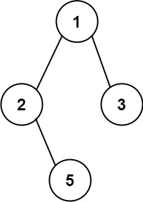

# 257. Binary Tree Paths

🟢 Easy

Given the root of a binary tree, return all root-to-leaf paths in any order.

A leaf is a node with no children.

Example 1:

```
Input: root = [1,2,3,null,5]
Output: ["1->2->5","1->3"]
```

Example 2:
```
Input: root = [1]
Output: ["1"]
```

Constraints:
- The number of nodes in the tree is in the range [1, 100].
- -100 <= Node.val <= 100

## Approach
### DFS
- **Parsing**: 
    題目給出一個二元樹，要求將這棵樹的每個路徑記錄下來後並返回。

    這題要使用的技巧應該是DFS，因為要訪問每一個節點，把每一種路徑都記錄下來，那就需要用遞迴。

    二元樹的數值是int，但是題目要求將數值轉字串，所以要用到的就是to_string()這個function，
    要記的include string這個資料庫，這個function可以將數值轉字串。
    ```
    #include <string>
    to_string()
    ```

    首先建立要遞迴的function，要歷遍的樹必須要參數，然後是要回傳的vetor字串，因為要記錄所有路徑，所以用&，call by reference，
    而記錄當前這個路徑，也需要一個string，這裡直接輸入參數，call by value，數值會一路向下傳遞，但是並不會永遠紀錄，不會影響到本來的數值。
    ```
    void help(TreeNode* root, vector<string>& ret, string s) {}
    ```

    接著遞迴最重要的就是停止時機，因為要找到的是每個路徑，在遞迴的過程中，只要找到最尾巴的葉節點，
    就可以將到目前為止的路徑存起來了，而葉節點就是左右節點都為空的節點，所以當發現當前傳進來的point沒有左右子樹，
    那就是葉，將當前節點的數值轉成字串後，接到s的尾巴，然後加入ret之中後返回，這就收到一條路徑了。
    ```
    if(root->left == nullptr && root->right == nullptr) {
        s += to_string(root->val);
        ret.push_back(s);
        return;
    }
    ```

    接著開始遞迴的過程，只要不是葉節點，當有左子樹或是右子樹，就將子樹投入遞迴function的第一個參數，
    第二個參數就將要回傳的ret直接寫入，
    要注意的是第三個節點，在呼叫function的時候才把轉成字串的數值還有箭頭添上，如此操作在下一層s就會加上這些字元，
    但是返回的時候，這些數值並不會持續影響s的內容，s的內容還是未加上的狀態。
    ```
    if(root->left)
            help(root->left, ret, s+to_string(root->val)+"->");
    if(root->right)    
        help(root->right, ret, s+to_string(root->val)+"->");
    ```

    如此操作就可以取得所有路徑了。
- **空間複雜度**: O(N)
- **時間複雜度**: O(N)