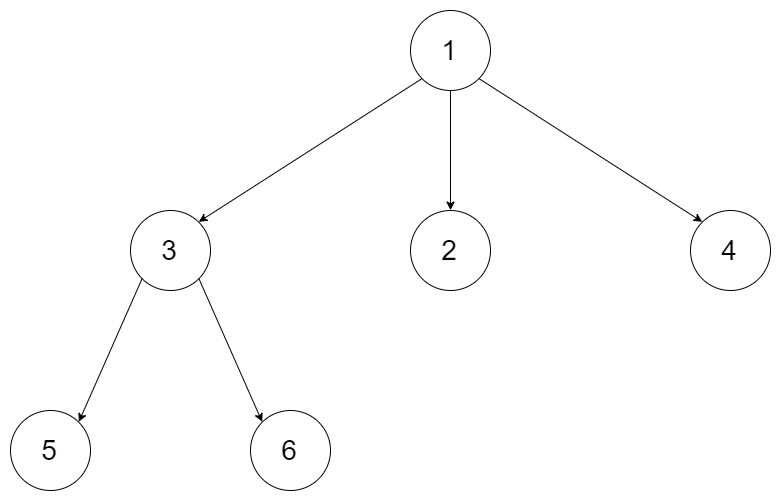
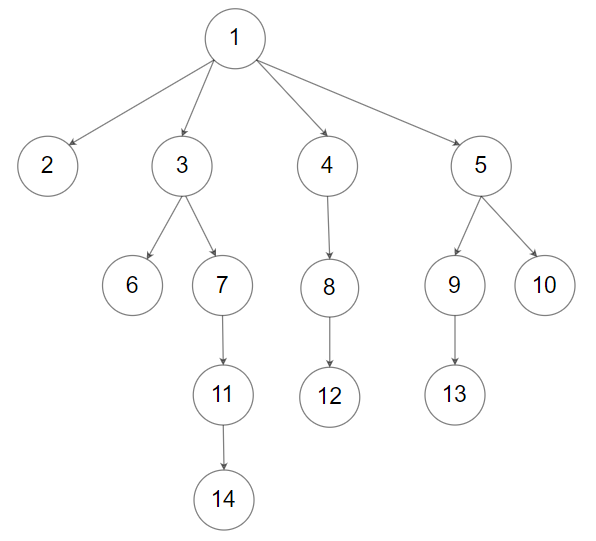

# 429. N-ary Tree Level Order Traversal

🟠 Medium

Given an n-ary tree, return the level order traversal of its nodes' values.

Nary-Tree input serialization is represented in their level order traversal, each group of children is separated by the null value (See examples).

Example 1:

```
Input: root = [1,null,3,2,4,null,5,6]
Output: [[1],[3,2,4],[5,6]]
```

Example 2:

```
Input: root = [1,null,2,3,4,5,null,null,6,7,null,8,null,9,10,null,null,11,null,12,null,13,null,null,14]
Output: [[1],[2,3,4,5],[6,7,8,9,10],[11,12,13],[14]]
```

Constraints:
- The height of the n-ary tree is less than or equal to 1000
- The total number of nodes is between [0, 104]

## Approach
### BFS
- **Parsing**: 
    題目給出一個變種樹，不是二元樹，類似樹，但是節點並不只有兩個，而是用vector包裝起來的多個節點，要將其按造階層蒐集起來並存放到vector<vector<int>>中。

    這裡依樣使用queue來解題，透過BFS，就可以廣度搜尋每一層的節點，並將其放到vector中，唯一有點變種的地方在於，二元樹的話，要檢查的左右是否有節點，
    但是改成vector之後，透過掃完節點內容，及可把節點填回去queue中，如下
    ```
    for(int l=0;l<curr->children.size();l++) {
        q.push(curr->children[l]);
    }
    ```
- **空間複雜度**: O(N)
- **時間複雜度**: O(N)