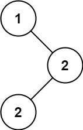

# 501. Find Mode in Binary Search Tree

🟢 Easy

Given the root of a binary search tree (BST) with duplicates, return all the mode(s) (i.e., the most frequently occurred element) in it.

If the tree has more than one mode, return them in any order.

Assume a BST is defined as follows:

- The left subtree of a node contains only nodes with keys less than or equal to the node's key.
- The right subtree of a node contains only nodes with keys greater than or equal to the node's key.
- Both the left and right subtrees must also be binary search trees.

Example 1:

```
Input: root = [1,null,2,2]
Output: [2]
```

Example 2:
```
Input: root = [0]
Output: [0]
```

Constraints:
- The number of nodes in the tree is in the range [1, 104].
- -105 <= Node.val <= 105

Follow up: Could you do that without using any extra space? (Assume that the implicit stack space incurred due to recursion does not count).

## Approach
### Inorder
- **Parsing**: 
    題目給出一個tree，要求回傳這個tree中，出現次數最多的數字，假如出現次數依樣，就一起回傳，順序不拘。

    這題的重點是要用哪種方式去歷遍，題目已經提出，這個樹是BST了，BST的重點就是他的左樹一定小於根，右樹一定大於根，
    在這個前提下，你一定可以知道透過inorder，左中右，可以從小到大的歷遍整棵樹，
    有這個前提後，剩下的工作就好辦了，inorder歷遍有兩種，一種是透過recursive，一種是透過stack，

    以下先用inorder，
    建立一個用來做遞迴的function，這裡採用unordered map來記錄每個數字的總數，
    題目要求回傳出現頻率最多的數字，所以需要一個變數來計算最大出現次數，maxCnt，
    然後是回傳的vector，ret。
    ```
     void help(TreeNode* root, unordered_map<int, int>& mp, int& maxCnt, vector<int>& ret) {
    ```

    遞迴最重重要的停止條件，
    在inorder，要確認root是否指向nullptr，是的話就停止並回傳。
    ```
    if(root==nullptr) {
        return;
    }
    ```

    然後要開始inorder，inorder的重點是左中右，先嘗試一路向左到底，接著才處理root的數值，最後再繼續向右，
    透過這種方式就可以再BST樹中從小到大的走完。
    ```
    help(root->left, mp, maxCnt, ret);
        
    ****process

    help(root->right, mp, maxCnt, ret);
    ```

    以下是上面對於中的處理過程，首先要將數值記錄到map中，接著取出map中對於當前curr的數量紀錄，
    只要數量大於最大值，那就清除ret，將數值推入ret，
    數量等於最大值的時候，將數值推入ret即可。
    ```
    mp[root->val]++;

    int cnt = mp[root->val];

    if(cnt > maxCnt) {
        maxCnt = cnt;
        ret.clear();
        ret.push_back(root->val);
    }
    else if(cnt==maxCnt) {
        ret.push_back(root->val);
    }
    ```

    第二種方法是用stack完成inorder，這裡要記清楚做法，
    用stack歷遍的時候要記得，while的條件不能只有stack不為空，還要curr指針不為空才行，
    因為有可能stack已經沒有了，這時候是走回到根結點，但是curr還在，
    inorder是左中右，所以一開始curr push進去後都要往左走，直到curr為空時，再從stack中把指標取出來，
    取出來後嘗試把指針移到右節點，這時候再回到第一行，指針就會被push進stack，
    這個算是要背熟的patterm，要用stack歷遍必須熟記。
    ```
    stack<TreeNode*> st;
    TreeNode* curr = root;
    while(curr!=nullptr || !st.empty()) {
        if(curr!=nullptr) {
            st.push(curr);
            curr = curr->left;
        }
        else {
            curr = st.top();
            st.pop();

            *****process

            curr = curr->right;
        }
    }
    ```

    接著解釋process的部分，這裡採用不同的做法，前面遞迴使用unordered_map，這裡改用兩個指針比較，
    建立curr跟prev指針，
    當prev為空，代表這是最開始的狀況，要處理第一個節點了，所以只要把cnt設定為1就好，
    假如prev不為空，就要來比較curr跟prev的數值是否相等，相等就把cnt加一，不相等的話，因為是inorder，所以已經開始走到另一個數字了，所以將cnt回歸為一，
    ```
    if(prev == nullptr) {
        prev = curr;
        cnt=1;
    }
    else {
        if(curr->val == prev->val) {
            cnt++;
        }
        else {
            cnt=1;
        }
    }
    ```

    只要cnt大於最大紀錄，那就更新最大紀錄，並且清空ret然後推入新的數值，
    但是不要忘記，題目有要求，多個數值出現頻率一樣的話，也要回傳，所以也要考慮到出現次數相等的狀態，
    所以數量相等時，也要把數值推入。
    ```
    if(cnt>maxCnt) {
        maxCnt = cnt;
        ret.clear();
        ret.push_back(curr->val);
    }
    else if(cnt==maxCnt) {
        ret.push_back(curr->val);
    }
    ```
- **空間複雜度**: O(N)
- **時間複雜度**: O(N)