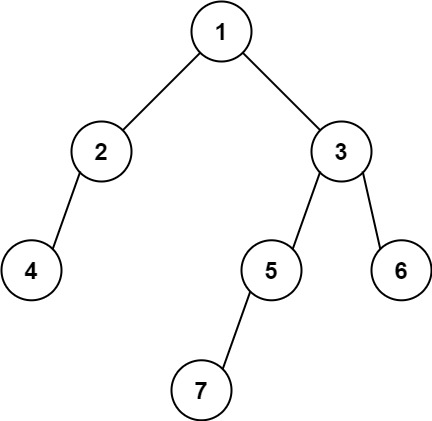

# 513. Find Bottom Left Tree Value

🟠 Medium

Given the root of a binary tree, return the leftmost value in the last row of the tree.

Example 1:

```
Input: root = [2,1,3]
Output: 1
```

Example 2:

```
Input: root = [1,2,3,4,null,5,6,null,null,7]
Output: 7
```

Constraints:
- The number of nodes in the tree is in the range [1, 104].
- -231 <= Node.val <= 231 - 1

## Approach
### BFS
- **Parsing**: 
    題目給出一個樹，要求找到這個樹的最下層的最左邊的葉子，將其數值回傳。

    這題可以通過queue完成的BFS來找到，只要每下一層就將counter+1，因為每次都是從最左邊的節點開始push進queue之中，所以只要每下一層，就將
    該層的第一個節點記錄起來，那就可以了。
- **空間複雜度**: O(N)
- **時間複雜度**: O(N)