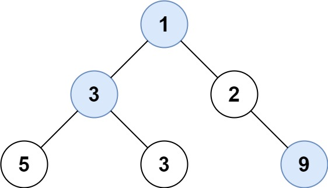

# 515. Find Largest Value in Each Tree Row

🟠 Medium

Given the root of a binary tree, return an array of the largest value in each row of the tree (0-indexed).

Example 1:

```
Input: root = [1,3,2,5,3,null,9]
Output: [1,3,9]
```

Example 2:
```
Input: root = [1,2,3]
Output: [1,3]
```

Constraints:
- The number of nodes in the tree will be in the range [0, 104].
- -231 <= Node.val <= 231 - 1

## Approach
### BFS
- **Parsing**: 
    題目給出一個樹，要求找出樹每一層的最大值。

    這題使用queue來實現BFS即可，通過queue來訪問每一層，並且在訪問的過程中，比對每一個節點的大小即可。
- **空間複雜度**: O(N)
- **時間複雜度**: O(N)