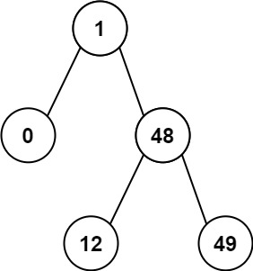

# 530. Minimum Absolute Difference in BST

🟢 Easy

Given the root of a Binary Search Tree (BST), return the minimum absolute difference between the values of any two different nodes in the tree.

Example 1:

```
Input: root = [4,2,6,1,3]
Output: 1
```

Example 2:

```
Input: root = [1,0,48,null,null,12,49]
Output: 1
```

Constraints:
- The number of nodes in the tree is in the range [2, 104].
- 0 <= Node.val <= 105

## Approach
### DFS, preorder
- **Parsing**: 
    題目給出一個BST樹，要求給出任意兩個節點之間，最小的差值。

    這題可以通過stack來執行前序遍歷完成，因為在BST樹中，左節點一定小於根節點，右節點一定大於根節點，所以只需要比較任意兩個相鄰節點差值即可，
    而通過前序遍歷，更可以從小到大來歷遍整個樹。

    首先建立用來歷遍的stack，接著是用來輔助的curr以及prev的TreeNode point，curr可以指向當前節點，prev可以指向前一次的節點，兩者數值相減就可以得出差值，
    最後是用來記錄最小差值的min_val。
    ```
    stack<TreeNode*> st;
    TreeNode* curr = root;
    TreeNode* prev = nullptr;
    int min_val = INT_MAX;
    ```

    通過stack歷遍的時候，while的條件有兩個，一個是curr不等於nullptr，另一個是st不能為空，
    因為有時候走到底的時候，curr可能為空，但是stack裡面還有數值，代表還沒有歷遍完，所以需要兩個條件。
    ```
    while(curr!=nullptr || !st.empty()) {
    ```

    接著開始進行歷遍，因為是採用前序，所以是先嘗試向左到底，
    所以這裡只要curr不是null，那就要不斷地塞入stack，然後一路向左，直到為空的時候就知道要開始回頭檢查。
    ```
    if(curr!=nullptr) {
        st.push(curr);
        curr=curr->left;
    }
    ```

    當curr為空，從根節點一路到最左節點的內容都已經進入stack了，這時候依序取出stack的內容就會從最左下方開始取出節點，
    取出後就可以丟棄。
    ```
    else {
        curr = st.top();
        st.pop();
    ```

    接著比較最小差值，當第一次取出數值的話，prev還沒有被賦予數值，所以等到有數值的時候，再進行比較，
    因為是在BST中走前序歷遍，所以前一個數值一定會小於當前數值，
    所以用當前節點的值減去前一個節點的值就一定會是正數。
    ```
    if(prev != nullptr) {
        min_val = min(min_val, curr->val-prev->val);
    }
    ```

    最後再將當前的節點賦予給前一個節點，
    然後這裡就是精華，在stack歷遍中，假如有右節點，當指向右節點後，會先被塞進stack中，
    接著會再去嘗試看看是否有左節點，沒有的話就會慢慢地將右節點填入，這個作法應該要熟練記起來。
    ```
    prev = curr;
    curr = curr->right;
    ```
- **空間複雜度**: O(N)
- **時間複雜度**: O(N)