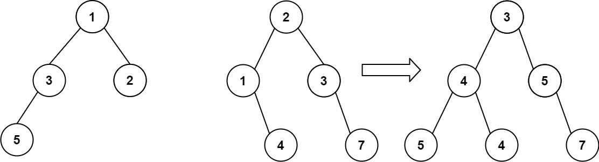

# 617. Merge Two Binary Trees

🟢 Easy

You are given two binary trees root1 and root2.

Imagine that when you put one of them to cover the other, some nodes of the two trees are overlapped while the others are not. You need to merge the two trees into a new binary tree. The merge rule is that if two nodes overlap, then sum node values up as the new value of the merged node. Otherwise, the NOT null node will be used as the node of the new tree.

Return the merged tree.

Note: The merging process must start from the root nodes of both trees

Example 1:

```
Input: root1 = [1,3,2,5], root2 = [2,1,3,null,4,null,7]
Output: [3,4,5,5,4,null,7]
```

Example 2:
```
Input: root1 = [1], root2 = [1,2]
Output: [2,2]
```

Constraints:
- The number of nodes in both trees is in the range [0, 2000].
- -104 <= Node.val <= 104

## Approach
### Recursive
- **Parsing**: 
    題目給出兩個tree，要求將兩個樹結合後返回。

    這題可以採用遞迴完成，只要進到function後的節點，判斷是否三次，
    第一個，判斷是否兩個節點都是空，都為空就返回空節點即可。
    ```
    if(root1 == nullptr && root2 == nullptr) {
        return nullptr;
    }
    ```

    第二個跟第三個，只要兩個節點其中之一為空，返回不為空的節點。
    ```
    else if(root1 != nullptr && root2 == nullptr) {
        return root1;
    }
    else if(root1 == nullptr && root2 != nullptr) {
        return root2;
    }
    ```

    通過判斷式的節點，兩個都不為空，這時候就可以將其內容相加起來了，
    可以選擇將其中一個節點加到另一個上面，但是要注意，
    作為被加的節點，就需要去承接之後的內容，這裡我是選擇root1作為被加。
    ```
    root1->val += root2->val;
    ```

    接著只要重複執行，遞迴，最後返回被加的節點，也就是root1，即可完成。
    ```
    root1->left = mergeTrees(root1->left, root2->left);
    root1->right = mergeTrees(root1->right, root2->right);

    return root1;
    ```
- **空間複雜度**: O(1)
- **時間複雜度**: O(N)