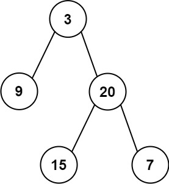
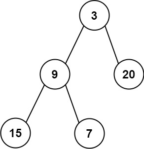

# 637. Average of Levels in Binary Tree

🟢 Easy

Given the root of a binary tree, return the average value of the nodes on each level in the form of an array. Answers within 10-5 of the actual answer will be accepted.

Example 1:

```
Input: root = [3,9,20,null,null,15,7]
Output: [3.00000,14.50000,11.00000]
Explanation: The average value of nodes on level 0 is 3, on level 1 is 14.5, and on level 2 is 11.
Hence return [3, 14.5, 11].
```

Example 2:

```
Input: root = [3,9,20,15,7]
Output: [3.00000,14.50000,11.00000]
```

Constraints:
- The number of nodes in the tree is in the range [1, 104].
- -231 <= Node.val <= 231 - 1

## Approach
### BFS
- **Parsing**: 
    題目要求，將給出的tree，每一層的內容相加後平均，填入一個vector後返回。
    這題可以簡單的使用queue，根據BFS來掃完tree的每一層，接著累加後平均即可。
- **空間複雜度**: O(N)
- **時間複雜度**: O(N)