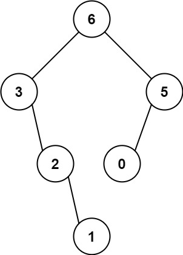
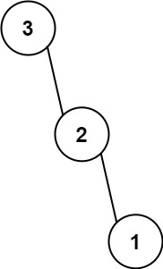

# 654. Maximum Binary Tree

🟠 Medium

You are given an integer array nums with no duplicates. A maximum binary tree can be built recursively from nums using the following algorithm:

1. Create a root node whose value is the maximum value in nums.
2. Recursively build the left subtree on the subarray prefix to the left of the maximum value.
3. Recursively build the right subtree on the subarray suffix to the right of the maximum value.

Return the maximum binary tree built from nums.

Example 1:

```
Input: nums = [3,2,1,6,0,5]
Output: [6,3,5,null,2,0,null,null,1]
Explanation: The recursive calls are as follow:
- The largest value in [3,2,1,6,0,5] is 6. Left prefix is [3,2,1] and right suffix is [0,5].
    - The largest value in [3,2,1] is 3. Left prefix is [] and right suffix is [2,1].
        - Empty array, so no child.
        - The largest value in [2,1] is 2. Left prefix is [] and right suffix is [1].
            - Empty array, so no child.
            - Only one element, so child is a node with value 1.
    - The largest value in [0,5] is 5. Left prefix is [0] and right suffix is [].
        - Only one element, so child is a node with value 0.
        - Empty array, so no child.
```

Example 2:

```
Input: nums = [3,2,1]
Output: [3,null,2,null,1]
```

Constraints:
- 1 <= nums.length <= 1000
- 0 <= nums[i] <= 1000
- All integers in nums are unique.

## Approach
### Recursive
- **Parsing**: 
    題目給出一個陣列，已經指定要用遞迴來建立二元樹了，只要找到指定範圍的最大值就會是當前樹的root，剩下的部分，最大值的左半邊為左子樹，右半邊為右子樹，
    採用相同的邏輯再來一遍即可。

    建立一個新的輔助function，需要有起點跟終點，這樣才可以確定建立樹的範圍。
    ```
    TreeNode* help(vector<int>& nums, int start, int end) {
    ```

    遞迴最重要的就是建立停止規則，這裡使用的是起點不能大於終點，當超過就返回空指標。
    ```
    if(start > end) {
        return nullptr;
    }
    ``` 

    接著在當前範圍找到最大值。
    ```
    int max = INT_MIN;
    int max_idx = 0;

    for(int i=start;i<=end;i++) {
        if(nums[i] > max) {
            max = nums[i];
            max_idx = i;
        }
    }
    ```

    接著用最大值建立當前節點，然後進行遞迴，來建立左右子樹，一路遞迴完成即可。
    ```
    TreeNode* root = new TreeNode(max);

    root->left = help(nums, start, max_idx-1);
    root->right = help(nums, max_idx+1, end);
    ```
- **空間複雜度**: O(N^2)
- **時間複雜度**: O(N)