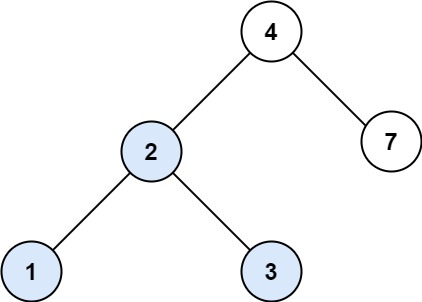
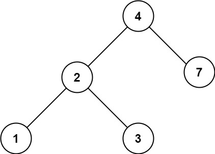

# 700. Search in a Binary Search Tree

🟢 Easy

You are given the root of a binary search tree (BST) and an integer val.

Find the node in the BST that the node's value equals val and return the subtree rooted with that node. If such a node does not exist, return null.

Example 1:

```
Input: root = [4,2,7,1,3], val = 2
Output: [2,1,3]
```

Example 2:

```
Input: root = [4,2,7,1,3], val = 5
Output: []
```

Constraints:
- The number of nodes in the tree is in the range [1, 5000].
- 1 <= Node.val <= 107
- root is a binary search tree.
- 1 <= val <= 107

## Approach
### BFS
- **Parsing**: 
    題目給出一個tree跟一個數值，要求找出這個tree中是否有哪個節點的數值跟題目給的數值相同，假如相同，將這個節點包含後續的節點一起返回，都沒有的話就回傳nullptr。

    這題很簡單，直接使用queue來實現BFS，將每個節點推入queue，然後再一一檢查val，當val符合，將該節點返回即可。
- **空間複雜度**: O(N)
- **時間複雜度**: O(N)